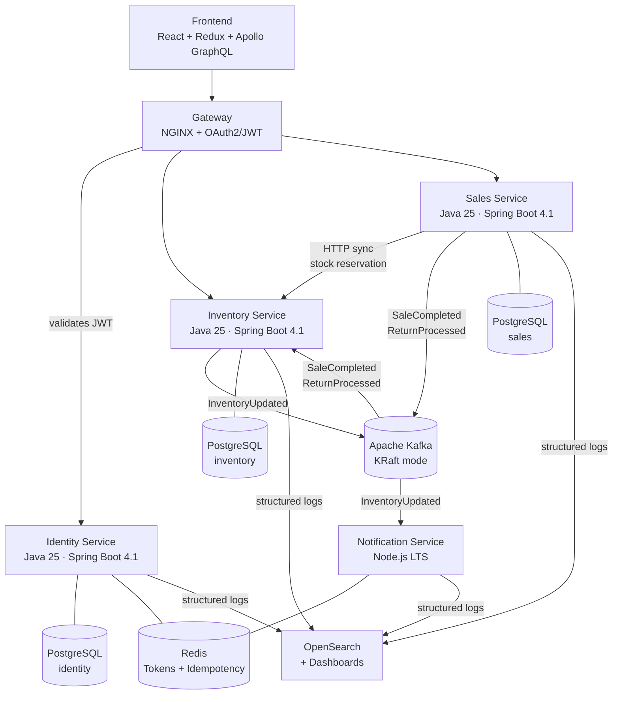

# pharma-ops-platform


> Event-driven microservices platform for multi-store pharmacy chain management.
> Built as a portfolio project to demonstrate production-grade Java architecture.

---

## Overview

**pharma-ops-platform** is a backend platform that manages the day-to-day operations of a pharmacy chain with multiple store locations. Each store runs its own inventory, point of sale and team, while the network consolidates data into unified financial and stock reports.

The project was designed with real business requirements validated by a domain expert (pharmacist), including controlled medication tracking, lot expiration control (FEFO), forced sales authorization and store-level RBAC.

### Why this project?

Most portfolio projects demonstrate technical skills in isolation. This one was designed to demonstrate **architectural decision-making** — the ability to choose the right tool for each problem, justify trade-offs, and structure a system that could scale to production.

---

## Architecture



### Key architectural characteristics

- **Hexagonal Architecture** inside each Java service — domain logic is completely isolated from frameworks. The `domain` and `application` layers have zero Spring/JPA/Kafka dependencies.
- **Event-Driven** communication between services via Kafka (KRaft, no Zookeeper).
- **One exception to async**: Sales → Inventory is a synchronous HTTP call for stock reservation. Async would allow two simultaneous sales of the last unit to both succeed — unacceptable for controlled medications (see ADR-001).
- **CQRS (light)**: report tables are separate from transactional tables and fed by Kafka events, so heavy queries never compete with real-time transactions.
- **Database per service**: no shared schemas, no cross-service foreign keys. Inter-domain integrity is guaranteed by events, not the database.

---

## Tech Stack

| Layer | Technology | Version |
|---|---|---|
| Backend | Java + Spring Boot + Spring MVC | Java 25 · Boot 4.1.0 |
| API | GraphQL | Spring for GraphQL |
| Security | Spring Security + JWT (jjwt) | Security 7.1.0 |
| Notification Service | Node.js + Express + KafkaJS | Node.js LTS 22+ |
| Database | PostgreSQL | 16 |
| Schema migration | Liquibase | 4.x |
| Messaging | Apache Kafka (KRaft) | apache/kafka:latest |
| Cache & idempotency | Redis | 7 |
| Observability | OpenSearch + Dashboards | 2.13.0 |
| Frontend | React + Redux + React Query + Apollo | 18+ |
| Containers | Docker + Docker Compose | — |
| CI/CD | GitHub Actions → AWS ECR → ECS | Planned (Phase 7) |

---

## Getting Started

### Prerequisites

- Docker Desktop 4.x+
- Java 25 (or 21 LTS)
- Node.js LTS 22+
- Git

### Run the infrastructure locally

```bash
git clone https://github.com/LydiaGarcia03/pharma-ops-platform.git
cd pharma-ops-platform

# Start all infrastructure containers
# (PostgreSQL × 5, Redis, Kafka, OpenSearch, OpenSearch Dashboards)
docker compose up -d

# Verify all containers are healthy
docker compose ps
```

### Run a service locally (example: identity-service)

```bash
cd services/identity-service

# Set environment variables (or use IntelliJ run configuration)
export ADMIN_EMAIL=admin@pharmaops.com
export ADMIN_PASSWORD=InitialPassword@2026
export ADMIN_NAME="Network Administrator"

mvn spring-boot:run
```

The service will start on `http://localhost:8081` and apply Liquibase migrations automatically.

### Service ports

| Service | Port |
|---|---|
| identity-service | 8081 |
| inventory-service | 8082 |
| sales-service | 8083 |
| notification-service | 8084 |
| OpenSearch Dashboards | 5601 |

---

## Project Structure

```
pharma-ops-platform/
├── services/
│   ├── identity-service/       # Java 25 · Spring Boot 4.1.0
│   ├── inventory-service/      # Java 25 · Spring Boot 4.1.0
│   ├── sales-service/          # Java 25 · Spring Boot 4.1.0
│   └── notification-service/   # Node.js LTS (Phase 3)
├── frontend/                   # React (Phase 2+)
├── gateway/                    # NGINX config (Phase 4)
├── docker-compose.yml
└── README.md
```

### Hexagonal architecture (per Java service)

```
src/main/java/com/pharmaops/{service}/
├── domain/          # Pure Java — zero framework dependencies
│   ├── model/       # Domain entities (User, Product, Sale...)
│   └── exception/   # Domain exceptions
├── application/     # Pure Java — zero framework dependencies
│   ├── port/in/     # Use case interfaces (input ports)
│   ├── port/out/    # Repository/publisher interfaces (output ports)
│   └── usecase/     # Use case implementations
└── infrastructure/  # Spring, JPA, Kafka, GraphQL live here
    ├── graphql/     # GraphQL resolvers
    ├── persistence/ # JPA entities, Spring Data repos, adapters
    ├── kafka/       # Producers and consumers
    ├── redis/       # Token storage
    └── http/        # HTTP clients and internal endpoints
```

---

## Services

### Identity Service
Manages users, store-scoped RBAC, and JWT authentication. Issues access tokens (15 min) and refresh tokens (stored in Redis, 7 days). On first startup, creates an ADMIN user from environment variables with a forced password reset.

Roles: `ADMIN`, `MANAGER`, `RESPONSIBLE_PHARMACIST`, `CASHIER` — each scoped to a specific store. A user can be `MANAGER` at store A and `CASHIER` at store B.

### Inventory Service
Manages the product catalog, lot (batch) control with expiration dates, and per-store stock levels. Exposes an internal HTTP endpoint for synchronous stock reservation called by the Sales Service. Publishes `InventoryUpdated` events consumed by the Notification Service and the CQRS read models.

Stock policy: **FEFO** (First Expire, First Out) — the batch closest to expiration is consumed first.

### Sales Service
Handles point-of-sale transactions and returns. Calls the Inventory Service synchronously to reserve stock before confirming a sale. Sales of controlled medications and forced sales require a `RESPONSIBLE_PHARMACIST` user active at that store.

### Notification Service
Consumes `InventoryUpdated` events from Kafka and sends alerts when stock is depleted or products are nearing expiration. Uses Redis for idempotency (`notif:{type}:{product_id}:{store_id}` with configurable TTL) to prevent duplicate alerts.

---

## Key Design Decisions

Highlights:

**Why Kafka over RabbitMQ?**
Two independent consumers (Notification Service and CQRS read models) need to consume the same `InventoryUpdated` event. Kafka's consumer groups handle this natively. The event replay capability also allows rebuilding read models from history without re-processing business logic.

**Why is Sales → Inventory synchronous?**
Two simultaneous sales of the last unit of a controlled medication both succeeding would be a regulatory risk. A synchronous call with an atomic database update (`UPDATE inventory SET quantity = quantity - 1 WHERE quantity > 0`) guarantees exactly one sale wins. This is a deliberate CAP theorem trade-off: consistency over availability at that specific point.

**Why hexagonal architecture?**
It allows testing all business logic (use cases, domain rules) without starting Spring, without a database, and without Kafka. Unit tests run in milliseconds because the domain has no infrastructure dependencies. This also means migrating from JPA to another persistence mechanism would only require replacing the adapter, not touching business logic.

**Why CQRS for reports?**
Financial and stock movement reports involve aggregations across large datasets. Running these queries against the same tables used for real-time sales would create contention and slow down checkout. The CQRS read models are purpose-built for their specific report shape, updated asynchronously via Kafka events.

---

## Roadmap

| Phase | Description | Status |
|---|---|---|
| 1 | Foundation: Identity Service + infrastructure setup | 🔨 In progress |
| 2 | Core: Inventory Service + Sales Service + React basics | 🔲 Planned |
| 3 | Async messaging: Kafka integration + Notification Service | 🔲 Planned |
| 4 | Security: NGINX gateway + JWT + RBAC | 🔲 Planned |
| 5 | Reports: CQRS read models + Analytics DB | 🔲 Planned |
| 6 | Observability: OpenSearch dashboards + structured logging | 🔲 Planned |
| 7 | Cloud: GitHub Actions CI/CD + AWS deployment | 🔲 Planned |
| 8 | Extras: inter-store transfer, load tests | 🔲 Planned |

---

## Domain Highlights

The business domain was validated against real pharmacy operations, incorporating sector-specific requirements:

- **Controlled medications** require an active `RESPONSIBLE_PHARMACIST` at the store to complete a sale
- **FEFO inventory policy** ensures products closest to expiration are sold first, reducing waste and regulatory risk
- **Lot tracking** with expiration dates enables product recall tracing and pre-expiration alerts
- **Multi-store RBAC** allows different roles per store location for the same employee
- **SNGPC integration** (Brazil's controlled medication tracking system) is out of scope but the `controlled` flag in the product schema is designed for future extension

---

## License

This project is licensed under the MIT License.

---

> Built by [Lydia](https://github.com/LydiaGarcia03) · Blumenau, Brazil
